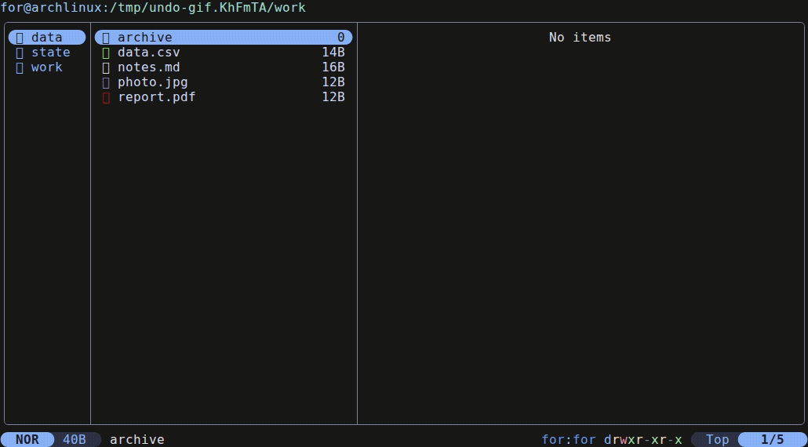
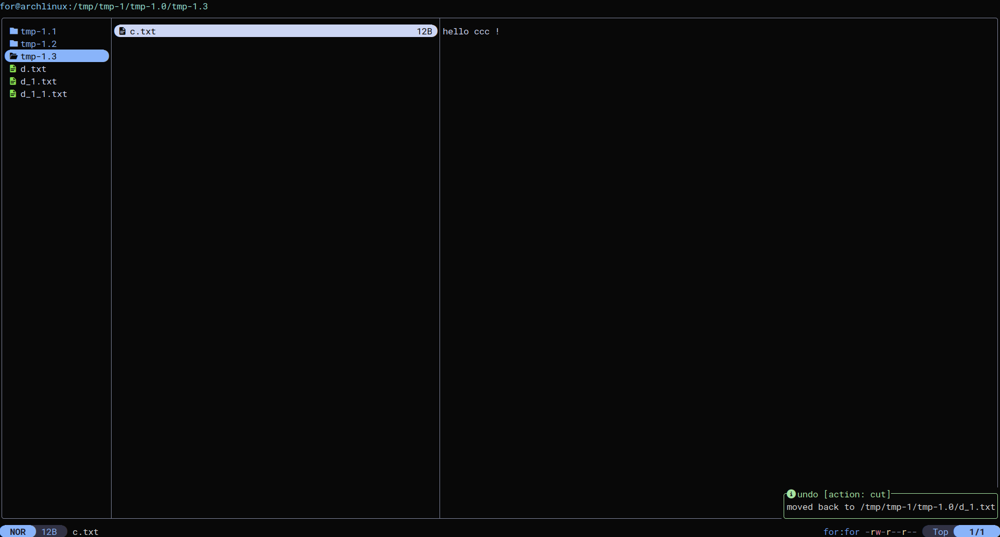
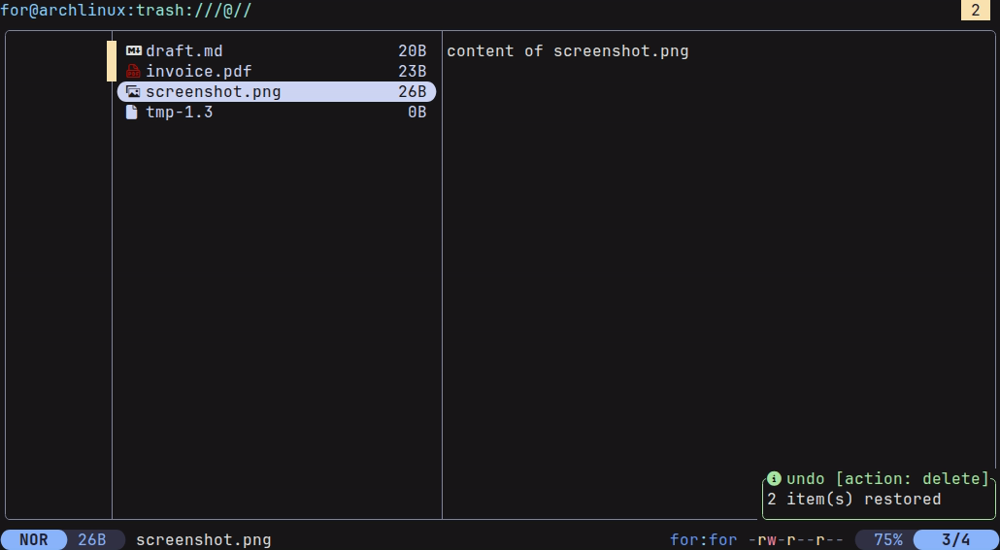

# undo.yazi

One key to undo the last file operation in [yazi](https://github.com/sxyazi/yazi).

Press `u`. The file comes back.

<!-- SCREENSHOT: assets/undo-delete.gif
     A short loop: hover a file, press d, the file disappears, press u, it returns.
     Record in a clean terminal at ~110x30. -->


## Contents

- [Why](#why)
- [Install](#install)
- [What it can undo](#what-it-can-undo)
- [What it will not do](#what-it-will-not-do)
- [Optional protection](#optional-protection)
- [How it works](#how-it-works)
- [Requirements](#requirements)
- [Troubleshooting](#troubleshooting)
- [License](#license)

## Why

yazi has no undo for file operations. Upstream, `u` exists only in `[input]`, where it
undoes typing in a rename field, and `[mgr]` has no `u` at all. This plugin gives the key
the meaning you expected.

## Install

```sh
ya pkg add typefor56/undo
```

```toml
# keymap.toml
[[mgr.prepend_keymap]]
on   = "u"
run  = "plugin undo"
desc = "Undo the last file operation"
```

That is the whole setup. Copy undo is included and always asks first,
[protecting `D`](#optional-protection) is opt in, and no other key is touched.

## What it can undo

| Operation | Key | Reversible | How |
| --- | --- | --- | --- |
| Delete to trash | `d` | Yes | restored from the system trash to its original path |
| Cut and paste | `x` then `p` | Yes | moved back to where it came from |
| Move | drag or `x` | Yes | same as cut |
| Rename | `r` | Yes | renamed back |
| Bulk rename | `R` | Yes | every name reverted |
| Copy and paste | `y` then `p` | Yes, with a prompt | the created copies are trashed |
| Permanent delete | `D` | **No**, unless protection is on | see below |

Inside `trash://`, `u` restores what you have hovered or selected instead.

<!-- SCREENSHOT: assets/notification.png
     The toast after undoing a cut, showing the "undo [action: cut]" title
     and the destination path in the body. -->


Every undo says what it did:

```
undo [action: delete]    3 files restored to ~/Downloads
undo [action: cut]       moved back to ~/Documents/reports
undo [action: copy]      2 copies moved to the trash
cancel [action: copy]    nothing changed
```

## What it will not do

- **It refuses rather than guesses.** An occupied destination or a file that changed since
  the operation gives a warning and touches nothing.
- **Permanent delete cannot be undone.** `D` unlinks, and no plugin recovers that.

## Optional protection

`D` can stage files in a private holding area instead of unlinking them:

```lua
-- init.lua
require("undo"):setup {
  purgatory = true,        -- D stages files instead of unlinking them
  purgatory_max_gb = 1,
  purgatory_max_days = 30,
}
```

```toml
# keymap.toml
[[mgr.prepend_keymap]]
on   = "D"
run  = "plugin undo -- purge"
desc = "Stage a permanent delete, recoverable with u"
```

Both halves are required, so either one alone leaves `D` exactly as yazi ships it. Think
before enabling it: pressing `D` and getting a staged copy is the opposite of what `D`
means, which is why it is off by default.

<!-- SCREENSHOT: assets/trash-restore.png
     yazi inside trash:// with two entries selected, about to press u. -->


## How it works

A journal and an inverter, nothing more.

- yazi broadcasts its own operations over [DDS](https://yazi-rs.github.io/docs/dds), so the
  plugin subscribes to `trash`, `move`, `rename`, `bulk-rename` and `duplicate`
- one record per operation goes to `~/.local/state/yazi/undo.log`, last 200 kept, paths
  percent encoded so a tab or a newline in a filename cannot break a line
- `u` pops the newest record and applies its inverse
- a file deleted from another filesystem comes back from that volume's own trash, such as
  `/tmp/.Trash-1000`, which is where the spec puts it

Copies arrive with the names yazi actually created, so a paste that landed as
`report_1.pdf` is undone by name and never by guess.

## Requirements

- yazi 26.0 or newer, for `trash://` and the current DDS payloads
- a freedesktop compliant trash, the default on Linux
- `mv`, used only when a restore has to cross filesystems

## Troubleshooting

**`g t` hangs on `Loading...`** Not the plugin. An orphaned `.trashinfo`, one whose file is
gone, makes yazi's trash listing never finish:

```sh
ls -1 ~/.local/share/Trash/info | wc -l
ls -1 ~/.local/share/Trash/files | wc -l
```

Different numbers mean orphans. Run `plugin undo -- clean-trash` to park them in
`Trash/orphaned-info`.

## License

MIT, see [LICENSE](LICENSE).
